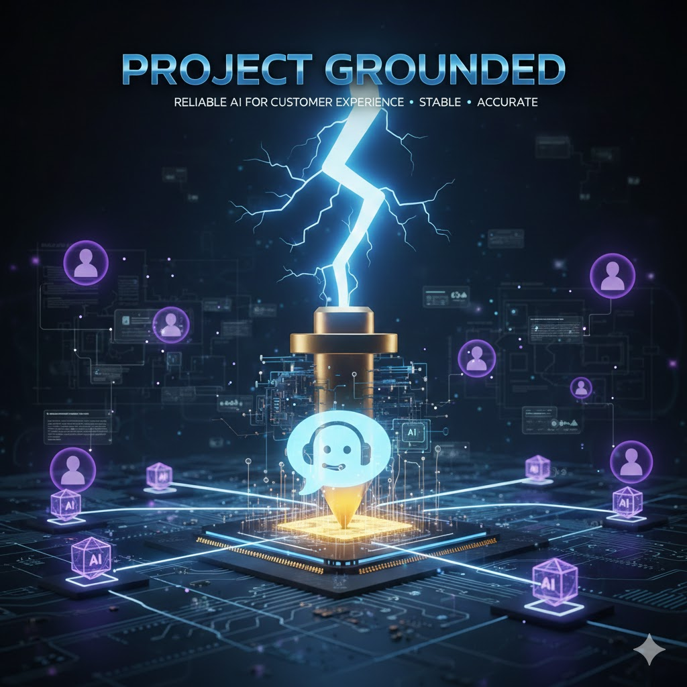

# Project Grounded


**Status:** Proof of Concept (POC)
**Focus:** Reliability, Robustness, and Accuracy in Agentic AI
**Target:** AI-native Applications and Website Builders

---

## 1. Why "Grounded"?

The name **Grounded** stems from an electrical engineering metaphor designed to solve a critical problem in Generative AI: **Volatility.**

In an electrical system, a high-voltage surge (like a bolt of lightning) represents raw power and speed. Without a **Ground**, that energy is unpredictable and can damage the system. In the world of Large Language Models (LLMs), "lightning" is the AI's creative intelligence, but without architectural "grounding," that intelligence often leads to hallucinations and logic errors.

* **The Current:** The rapid, high-performance capabilities of our AI agents.
* **The Ground:** The architectural safeguards and organizational data sources that anchor the AI to reality.

**Project Grounded** is a blueprint for building customer service features that are not just "smart," but fundamentally **reliable** and **stable** enough for production-grade user experiences.

---

## 2. POC Scope & "Organizational Capabilities"

**Primary Objective:** To validate a robust, event-driven agent orchestration pattern. This POC demonstrates how AI app and website creators can integrate "agentic" workflows that are grounded in their specific business data.

**The "Monolith" Abstraction:** In the architecture, you will see a "Company Data Lambda Monolith." For this POC:

* A single Node.js Lambda with PostgreSQL serves as the **Organizational Data Source** (billing, usage, subscriptions,
  customer info).
* The **Org Tools MCP Server** exposes data-fetching tools that interact with this monolith.
* This simplified approach avoids building multiple microservices while demonstrating how **Model Context Protocol (MCP)
  ** bridges AI agents and organizational data.
* Evaluator Lambdas use MCP tools to fetch the context they need to make assertions.

**Infrastructure Considerations:** For this POC we are aiming at low cost while maintaining security best practices:
* Single region deployment for simplicity
* **Single table design** for DynamoDB to reduce costs and simplify data management
* Self-Hosted Kafka instead of MSK to reduce cost by 80%
* VPC Endpoints instead of NAT Gateways for outbound traffic
* AWS Secrets Manager for securely storing API keys and other sensitive data
* Cloudflare Workers + Durable Objects for edge UI and real-time streaming
* GraphQL hosted on Cloudflare Worker to separate frontend and backend concerns
* Ruby on Rails APIs for CQRS command/query services

---

## 3. Architecture Overview

Project Grounded implements a **CQRS (Command Query Responsibility Segregation)** pattern with **event-driven
orchestration** for AI agent workflows.

### Frontend & Edge Layer (Cloudflare)

```
┌─────────────────────────────────────────────────────────┐
│                  Cloudflare Worker                       │
├─────────────────────────────────────────────────────────┤
│  Remix React UI  │  GraphQL API  │  SSE Router          │
│                  │  (mutations/  │  (routes to DO)      │
│                  │   queries)    │                      │
└─────────────────────────────────────────────────────────┘
                                            │
                                            ▼
                              ┌─────────────────────────┐
                              │   Durable Object        │
                              │   (SSE Streaming)       │
                              │                         │
                              │   Receives updates from │
                              │   Conversation Updates  │
                              └─────────────────────────┘
```

### CQRS Services (Ruby on Rails)

**Conversation Commands (Write Side):**

1. Receives command requests from GraphQL
2. Hydrates and validates data
3. Persists to DynamoDB
4. Produces events to `conversation-commands` Kafka topic

**Conversation Updates (Read Side):**

1. Consumes `conversation-commands` topic (for low latency)
2. Adapts command events into conversation update state
3. Persists current state to DynamoDB
4. Serves state for GraphQL query requests
5. Forwards updates to Cloudflare Durable Object for SSE streaming

### Intelligence Layer (AWS Lambda + Kafka)

```
┌──────────────────┐     ┌─────────────────────┐     ┌──────────────────┐
│    Actions       │────▶│  Evaluator Lambdas  │────▶│    Responder     │
│   Orchestrator   │     │  (Agent/Non-Agent)  │     │     Lambda       │
│                  │◀────│                     │     │                  │
│ Consumes:        │     │ Uses: Org Tools MCP │     │ Produces:        │
│ - Commands       │     │                     │     │ - Update events  │
│ - Decisions      │     │ Produces:           │     │ - Decision events│
│                  │     │ - Assertion events  │     │                  │
│ Produces:        │     └─────────────────────┘     └──────────────────┘
│ - Evaluation     │                                          │
│   events         │◀─────────────────────────────────────────┘
└──────────────────┘         (feedback loop)
```

**Actions Orchestrator Lambda:**

- Consumes `conversation-commands` AND `conversation-decision` events
- Persists state records to DynamoDB
- Decides what evaluations need to be made based on accumulated state
- Produces `conversation-evaluation` events

**Evaluator Lambdas (Agent & Non-Agent):**

- Consume `conversation-evaluation` events
- Use **Org Tools MCP Server** to fetch data from Company Data Lambda
- Make assertions/recommendations (with or without LLM)
- Produce `conversation-assertion` events

**Company Data Lambda (Node.js Monolith):**

- Single Lambda serving as the organizational data source (simplified POC approach)
- Uses PostgreSQL for company/customer data (billing, orders, subscriptions, etc.)
- Accessed by evaluators via MCP Server tools instead of building multiple microservices
- Provides the "ground truth" data that anchors AI agent decisions

**Responder Lambda:**

- Consumes `conversation-assertion` events
- Decides whether to respond with a conversation update
- Produces `conversation-update` events (updates client via DO → SSE)
- Produces `conversation-decision` events (feedback to orchestrator)

---

## 4. Kafka Topics

| Topic                     | Producer     | Consumer                  | Purpose                          |
|---------------------------|--------------|---------------------------|----------------------------------|
| `conversation-commands`   | Commands API | Updates API, Orchestrator | New commands/messages            |
| `conversation-evaluation` | Orchestrator | Evaluator Lambdas         | Request agent evaluation         |
| `conversation-assertion`  | Evaluators   | Responder                 | Agent assertions/recommendations |
| `conversation-decision`   | Responder    | Orchestrator              | Decision feedback loop           |
| `conversation-updates`    | Responder    | Updates API               | State updates for clients        |

---

## 5. The "Grounded" Data Flow

1. **User Action:** User sends a message via the React UI
2. **Command:** GraphQL mutation → Conversation Commands API → Kafka
3. **Quick Persist:** Conversation Updates API consumes command, persists state immediately (latency optimization)
4. **Orchestration:** Actions Orchestrator consumes command, persists state record, determines required evaluations
5. **Evaluation:** Evaluator Lambdas use MCP Server to fetch org data, make assertions
6. **Decision:** Responder Lambda synthesizes assertions, decides on response
7. **Update:** Conversation update sent to Updates API → Durable Object → SSE → Client

---

## 6. Key Considerations

1. **Latency Optimization:** Conversation Updates API listens directly to `conversation-commands` topic. This ensures
   new conversations are quickly persisted and available for client fetching.

2. **SSE Routing:** The Cloudflare Worker handles SSE routing to the Durable Object. GraphQL handles mutations/queries
   only.

3. **API Exposure:** For this POC, Conversation Commands and Updates APIs are HTTPS exposed so the CF Worker can
   interact with them. In a production application, these would be VPC-internal with the GraphQL layer in the same VPC.

---

## 7. Repository Structure

```
packages/
├── server/                        # Backend infrastructure layer
│   ├── shared/                    # Shared utilities (@grounded/server-shared)
│   │   ├── dynamo/                # DynamoDB client wrapper
│   │   ├── event-producer/        # Kafka producer with connection pooling
│   │   └── secrets-manager/       # AWS Secrets Manager client
│   ├── agents/                    # AI agent Lambdas
│   │   ├── shared/                # Shared agent utilities (@grounded/agents-shared)
│   │   ├── customer-spend-agent/  # Analyzes customer spending data
│   │   └── response-recommendation-agent/  # Generates response recommendations
│   ├── orchestrators/             # State machine orchestrators
│   │   ├── actions-orchestrator/  # Main orchestration Lambda
│   │   └── responder/             # Response decision Lambda
│   ├── mcp/                       # MCP servers
│   │   ├── state-machine-query-tools/  # DynamoDB query tools for agents
│   │   └── org-tools/             # Company Data Lambda integration tools
│   └── apis/                      # API implementations
│       ├── gateway-api/           # GraphQL API
│       └── company-data-api/      # Node.js Lambda monolith (PostgreSQL)
├── ui/
│   └── customer-ui/               # Remix + React frontend (Cloudflare Workers)
└── schemas/                       # Shared data schemas (@grounded/schemas)
    └── events/                    # Event type definitions

ruby-apis/                         # Ruby on Rails CQRS services
├── conversation-commands/         # Command side - writes
└── conversation-updates/          # Query side - reads

terraform/                         # AWS infrastructure-as-code
docs/                              # Architecture diagrams
```

---

## 8. Stretch Goals

- [x] Implement GraphQL layer
- [ ] Dockerize all infra / allow for local development
- [ ] Implement Outbox Pattern - DynamoDB Streams to Lambda producer
- [ ] Implement vector DB for embedded customer information to group similar customers for Agent evaluation
- [ ] Storybook Support
- [ ] Theming engine w/ styled components
- [ ] Build Admin decision review UI
- [ ] Build Agent refund requesting - ex. Agent has a limit of $50 they can refund but they can request overage for manual approval
- [ ] Implement commit-lint, husky, conventional commit and semantic release for versioning
- [ ] RDS proxy for connection pooling