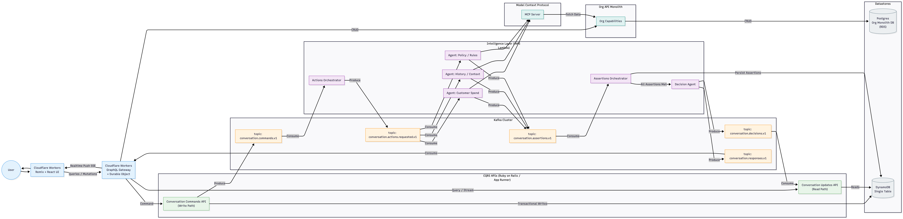
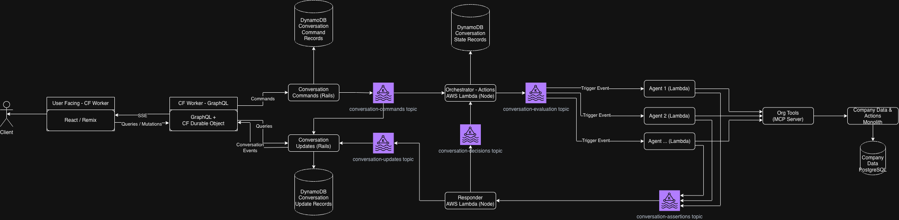

# Diagrams

## Mermaid

## DrawIO

# Code

```mermaid
flowchart LR

%% =====================
%% Style Definitions
%% =====================
classDef edge fill:#E3F2FD,stroke:#1E88E5,stroke-width:1px
classDef api fill:#E8F5E9,stroke:#43A047,stroke-width:1px
classDef kafka fill:#FFF3E0,stroke:#FB8C00,stroke-width:1px
classDef agent fill:#F3E5F5,stroke:#8E24AA,stroke-width:1px
classDef data fill:#ECEFF1,stroke:#546E7A,stroke-width:1px
classDef org fill:#E0F2F1,stroke:#00897B,stroke-width:1px

%% =====================
%% Frontend / Edge
%% =====================
User(("User")):::edge
CF["Cloudflare Workers<br>Remix + React UI"]:::edge
GQL["Cloudflare Workers<br>GraphQL Gateway<br>+ Durable Object"]:::edge

User --> CF
CF -->|Queries / Mutations| GQL
GQL -->|Realtime Push SSE| CF
CF --> User

%% =====================
%% APIs (CQRS)
%% =====================
subgraph APIs["CQRS APIs (Ruby on Rails / App Runner)"]
  CC["Conversation Commands API<br>(Write Path)"]:::api
  CU["Conversation Updates API<br>(Read Path)"]:::api
end

GQL -->|Command| CC
GQL -->|Query / Stream| CU

%% =====================
%% Datastores
%% =====================
subgraph Data["Datastores"]
  PG[("Postgres<br>Org Monolith DB<br>(RDS)")]:::data
  DDB[("DynamoDB<br>Single Table")]:::data
end

CC -->|Transactional Writes| DDB
CU -->|Reads| DDB

%% =====================
%% Kafka
%% =====================
subgraph Kafka["Kafka Cluster"]
  T1["topic: conversation.commands.v1"]:::kafka
  T2["topic: conversation.actions.requested.v1"]:::kafka
  T3["topic: conversation.assertions.v1"]:::kafka
  T4["topic: conversation.decisions.v1"]:::kafka
  T5["topic: conversation.responses.v1"]:::kafka
end

%% =====================
%% Intelligence Layer
%% =====================
subgraph Intelligence["Intelligence Layer (AWS Lambda)"]
  AO["Actions Orchestrator"]:::agent
  SA1["Agent: Customer Spend"]:::agent
  SA2["Agent: History / Context"]:::agent
  SA3["Agent: Policy / Rules"]:::agent
  ASO["Assertions Orchestrator"]:::agent
  DA["Decision Agent"]:::agent
end

%% =====================
%% Org Monolith API
%% =====================
subgraph MCP_APIs["Org API Monolith"]
  ORG_API["Org Capabilities"]:::org
end

ORG_API -->|CRUD| PG
GQL -->|CRUD| ORG_API

%% =====================
%% MCP
%% =====================
subgraph MCP["Model Context Protocol"]
  MCP3["MCP Server"]:::org
end

MCP3 -->|Fetch Data| ORG_API

%% =====================
%% Producers
%% =====================
CC -->|Produce| T1
AO -->|Produce| T2
SA1 -->|Produce| T3
SA2 -->|Produce| T3
SA3 -->|Produce| T3
DA -->|Produce| T4
DA -->|Produce| T5

%% =====================
%% Consumers
%% =====================
T1 -->|Consume| AO
T2 -->|Consume| SA1
T2 -->|Consume| SA2
T2 -->|Consume| SA3
T3 -->|Consume| ASO
ASO -->|All Assertions Met| DA
T4 -->|Consume| CU
T5 -->|Consume| GQL

%% =====================
%% MCP Calls
%% =====================
SA1 --> MCP3
SA2 --> MCP3
SA3 --> MCP3

%% =====================
%% State Persistence
%% =====================
ASO -->|Persist Assertions| DDB

```
